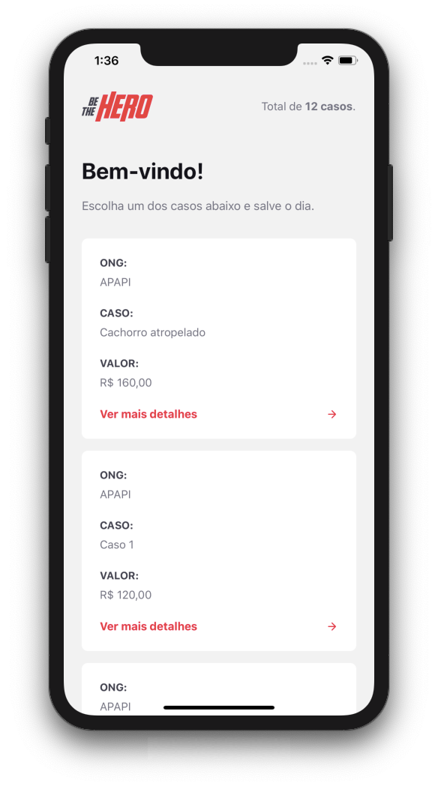
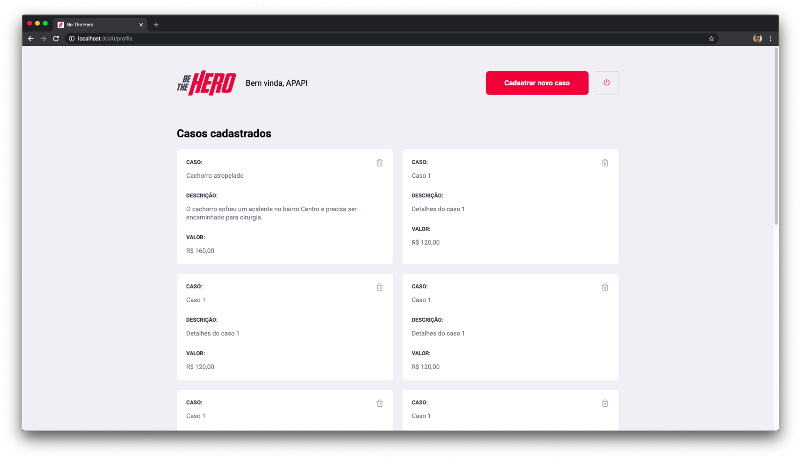

  

---

<h1 align="center">
Be The Hero
</h1>

<h2 align="center">
  Ajude uma ONG e torne-se um Herói
</h2>

  
  
  
  

  <a href="#projeto">Projeto</a>
  &nbsp;&nbsp;|&nbsp;&nbsp;
  <a href="#tecnologias">Tecnologias</a>
  &nbsp;&nbsp;|&nbsp;&nbsp;
  <a href="#como-executar">Como executar</a>
  &nbsp;&nbsp;|&nbsp;&nbsp;
  <a href="#como-contribuir">Como contribuir</a>
  &nbsp;&nbsp;|&nbsp;&nbsp;
  <a href="#licença">Licença</a>

# Projeto

  
  

Be The Hero é um projeto que visa aproximar ONGs e pessoas interessadas em ajudar.

Através do frontend web, as ONGs pode se cadastrar, e então postar os casos que ocorreram e pedir por ajuda.

Através do app mobile, pessoas podem visualizar os casos enviados pelas ONGs, e entrar em contato para oferecer ajuda.

# Tecnologias

Este projeto foi desenvolvido utilizando as seguintes tecnologias:

- [Node.js](https://nodejs.org/)
- [React](https://reactjs.org)
- [React Native](https://reactnative.dev)
- [Expo](https://expo.io)

# Como executar

### Requisitos

- [Node.js](https://nodejs.org/)
- [npm](https://npmjs.com/)
- [Expo-CLI](https://expo.io)

## Backend

- Estando na pasta raíz do projeto, navegue para o diretório do servidor com `cd backend`.
- Instale as dependências usando `npm install`.
- Realize as migrações do banco de dados com o comando `npx knex migrate:latest`
- Execute o servidor usando `npm start`.

## Frontend

- Estando na pasta raíz do projeto, navegue para o diretório do frontend com `cd frontend`.
- Instale as dependências usando `npm install`.
- Execute o dev server usando `npm start`.

## Mobile

- Estando na pasta raíz do projeto, navegue para o diretório do app mobile com `cd mobile`.
- Instale as dependências usando `npm install`.
- Execute o expo usando `expo start`.
- Execute o app em um emulador ou dispositivo físico:
  - Para emulador, inicie o emulador desejado (Android ou iOS), depois clique em `Run on Android emulator` ou `Run on iOS simulator`, dependendo da opção desejada.
  - Para dispositivo físico, instale o app Expo através da loja de aplicativos, e escaneie o QR code.

# Como contribuir

- Faça um fork desse repositório;
- Cria uma branch com a sua feature: `git checkout -b minha-feature`;
- Faça commit das suas alterações: `git commit -m 'feat: Minha nova feature'`;
- Faça push para a sua branch: `git push origin minha-feature`.

# Licença

Esse projeto está sob a licença MIT. Veja o arquivo [LICENSE](LICENSE) para mais detalhes.
